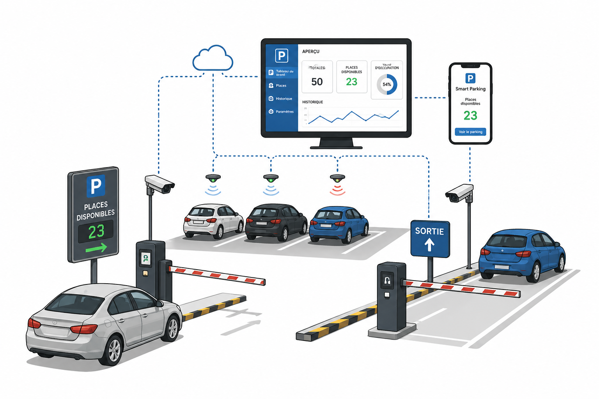
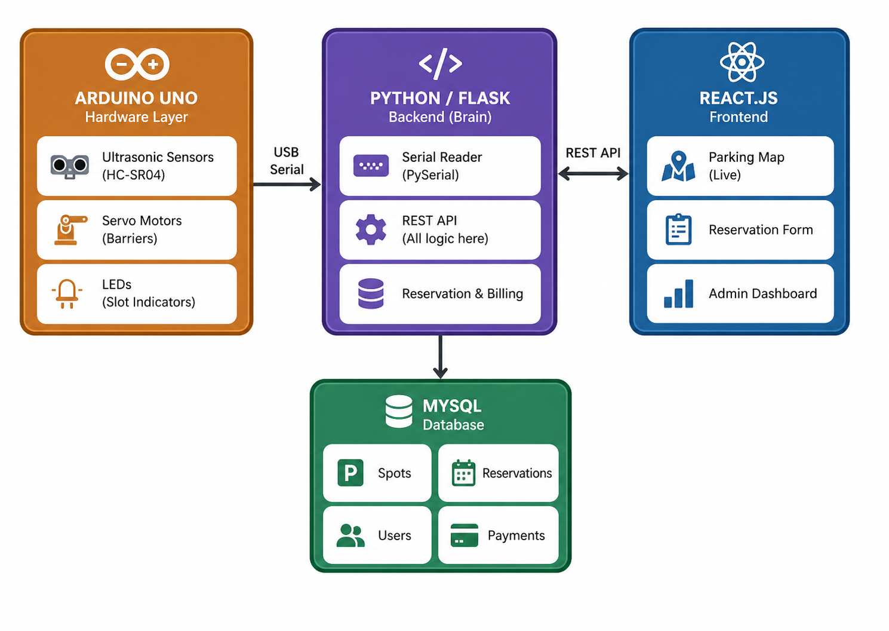
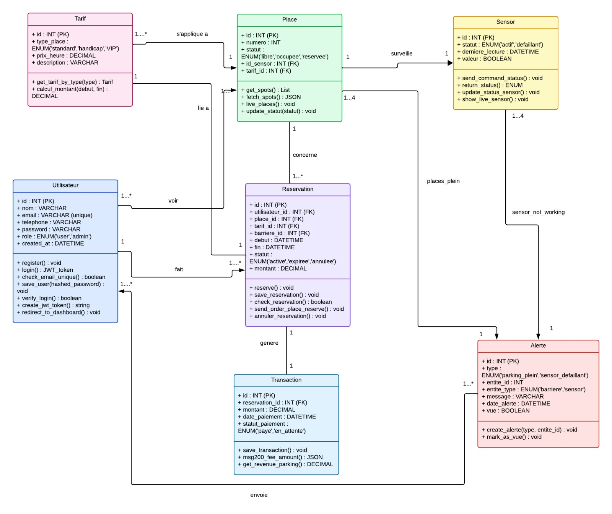
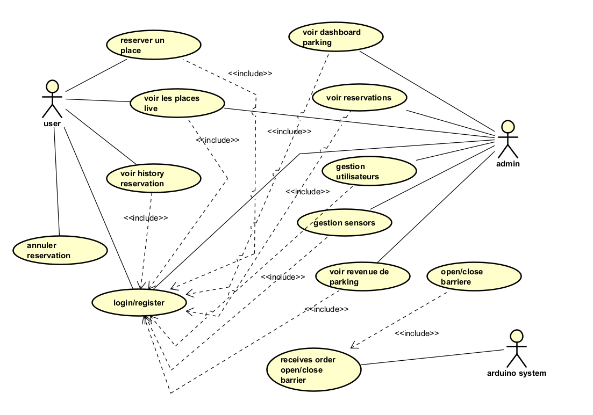
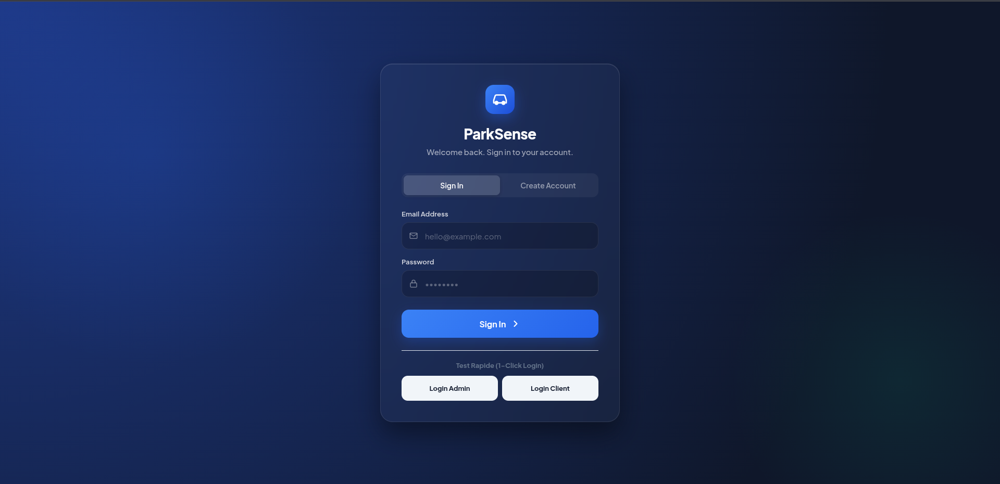
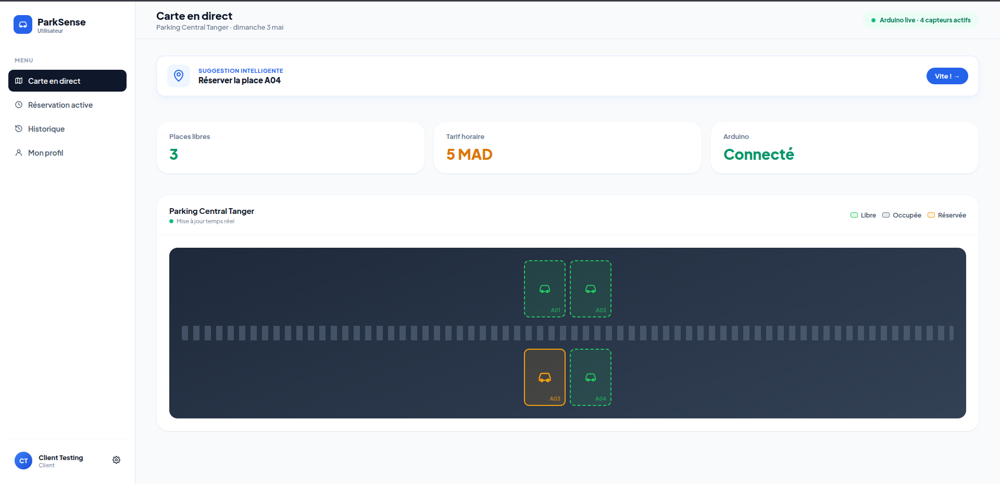
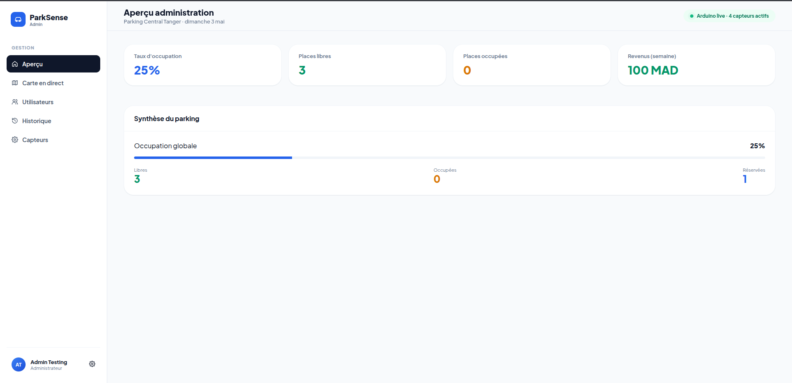
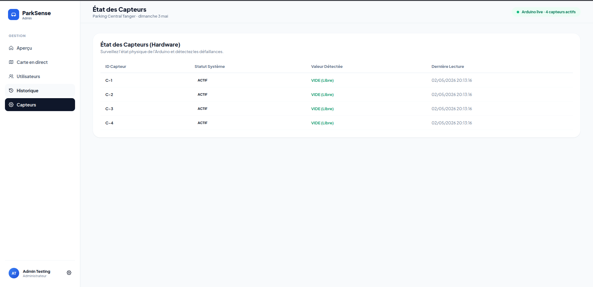
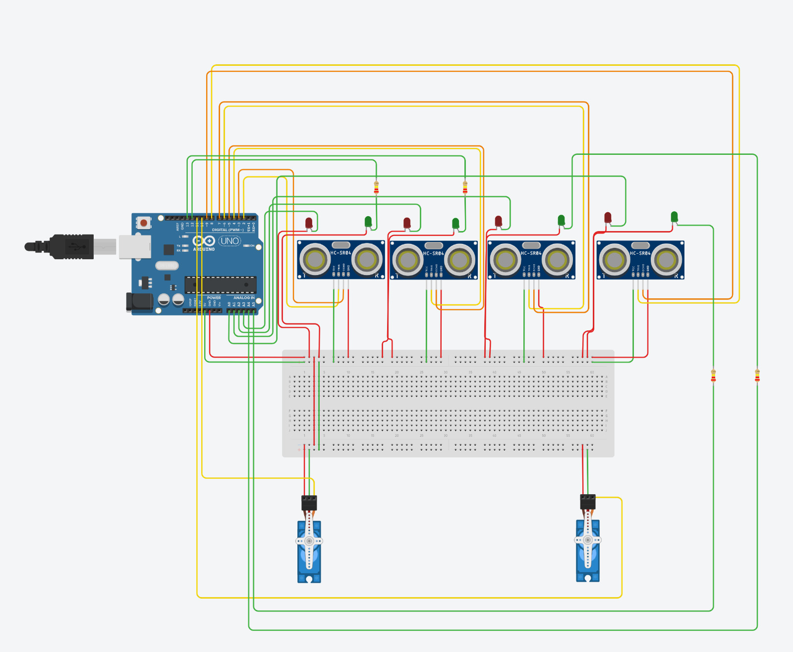

<div align="center">
  

  # SmartParking — ParkSense
  ### Système de Gestion Intelligente de Parking
  **Université Abdelmalek Essaâdi · Faculté des Sciences et Techniques de Tanger**
  *Cycle Ingénieur — Logiciel et Systèmes Intelligents · 2025–2026*

  *Encadré par **Pr. Mohamed BENAHMED***

  ---

  
  
  
  
</div>

---

## Équipe

| Nom |
|-----|
| Kerbab Sara |
| Benmaou Alae |
| Dami Sara |
| Nadi Lahjouji Mohamed Soulaimane |
| EL ARROUD Mohamed Reda |

---

## Présentation

**ParkSense** est un système embarqué et connecté qui automatise la gestion d'un parking :
- Détection en temps réel de l'occupation des places via **capteurs ultrasoniques HC-SR04**
- **Réservation en ligne** sans conflit (verrou atomique `select_for_update`)
- Contrôle des **barrières d'entrée/sortie** (servomoteurs) via port série USB
- **File d'attente** automatique quand le parking est complet
- Interface web **React** avec deux rôles : utilisateur et administrateur

---

## Architecture

<div align="center">
  
</div>

```
[HC-SR04 × 4]  →  Arduino UNO  ──USB Série 9600──→  Django API (port 8000)
[LEDs + Servos] ←                                          ↕
                                                      SQLite / MySQL
                                          ←── REST polling 2s ───→
                                                    React (port 5173)
```

**Principe cardinal :** l'Arduino ne prend aucune décision — il mesure et transmet.
Toute la logique métier réside côté serveur Django.

---

## Diagramme ERD

<div align="center">
  
</div>

---

## Diagramme des cas d'utilisation

<div align="center">
  
</div>

---

## Captures d'écran

### Page d'authentification
<div align="center">
  
</div>

### Vue utilisateur — Carte en direct


### Vue administrateur — Aperçu KPIs


### Vue administrateur — État des capteurs


### Schéma de câblage (Tinkercad)


---

## Installation

### Prérequis
- Python 3.10+, Node.js 18+
- Arduino IDE 2.x + câble USB Arduino UNO

### 1 — Backend (Django)

```bash
cd backend
python3 -m venv venv && source venv/bin/activate
pip install -r requirements.txt

python manage.py migrate          # crée db.sqlite3
python seed_db.py                 # tarifs + 4 capteurs + places A101-A104

python manage.py runserver        # http://127.0.0.1:8000
```

> Le thread série démarre automatiquement via `apps.py`.
> Brancher l'Arduino sur `/dev/ttyACM0` avant de lancer le serveur.

### 2 — Frontend (React + Vite)

```bash
cd frontend
npm install
npm run dev       # http://localhost:5173
```

### 3 — Arduino

Ouvrir `arduino/smart_parking/smart_parking.ino` dans l'Arduino IDE,
sélectionner **Arduino UNO** et le bon port COM, puis téléverser.

---

## API REST

| Méthode | Endpoint | Description |
|---------|----------|-------------|
| POST | `/api/auth/register/` | Créer un compte |
| POST | `/api/auth/login/` | Connexion |
| GET | `/api/spots/` | État de toutes les places |
| GET | `/api/sensors/` | État des capteurs (admin) |
| POST | `/api/reserve/` | Réserver une place |
| POST | `/api/cancel/` | Annuler une réservation |
| POST | `/api/entry/` | Ouvrir barrière entrée |
| POST | `/api/exit/` | Sortie + calcul tarif |
| POST | `/api/manual_gate/` | Contrôle manuel barrière (admin) |
| POST | `/api/join_queue/` | Rejoindre la file d'attente |
| GET | `/api/reservations/` | Historique réservations |
| GET | `/api/stats/` | KPIs revenus & occupation |

---

## Documentation

- [Architecture détaillée](docs/Architecture.md)
- [Base de données (ERD + SQL)](docs/Database.md)
- [API Documentation](docs/API_Documentation.md)
- [Fonctionnalités implémentées](docs/Features_Implemented.md)
- [Scénarios de test](docs/Test_Scenarios.md)

---

## Rapport technique

Le rapport complet (PDF) est disponible à la racine du dépôt : [`rapport.pdf`](rapport.pdf)
