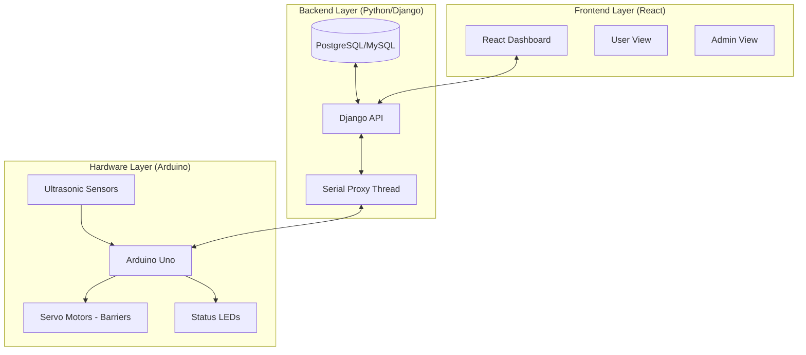

# SmartParking Architecture Report

## 1. System Overview
The SmartParking system is a distributed full-stack application designed to automate parking spot management using real-time sensor feedback and an interactive user dashboard.

## 2. Component Diagram

## 3. Communication Protocols
- **Arduino ↔ Python**: UART Serial (9600 baud). Data is exchanged using a custom string-based protocol (`S<id>:<dist>:<stat>`).
- **Python ↔ React**: RESTful JSON API.
- **Python ↔ Database**: Django ORM with atomic transactions to handle concurrent reservation requests.

## 4. Key Workflows
- **Real-time Updates**: Python reads the serial buffer constantly, updating the database state. React polls the backend every 2s to reflect changes on the live map.
- **Reservation Loop**: User selects a spot → Backend locks the row → Backend triggers 'RESERVE' command to Arduino (to update local LEDs) → Reservation record is created.
- **Entry/Exit**: Digital simulation buttons in the UI trigger physical barrier movements (Servos) via the serial link.
