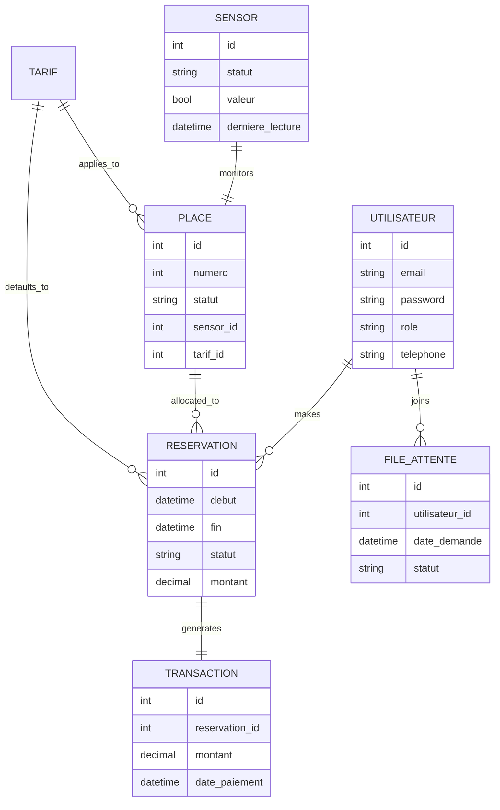

# Database Design & ERD

## 1. Entity Relationship Diagram (ERD)
The system uses a relational schema designed to maintain integrity across users, spots, and financial transactions.



## 2. SQL Schema
While Django handles the schema via `manage.py migrate`, the underlying SQL logic is equivalent to:

```sql
CREATE TABLE parking_sensor (
    id INTEGER PRIMARY KEY AUTOINCREMENT,
    statut VARCHAR(20),
    valeur BOOLEAN,
    derniere_lecture DATETIME
);

CREATE TABLE parking_place (
    id INTEGER PRIMARY KEY AUTOINCREMENT,
    numero INTEGER UNIQUE,
    statut VARCHAR(20),
    id_sensor_id INTEGER UNIQUE REFERENCES parking_sensor(id),
    tarif_id_id INTEGER REFERENCES parking_tarif(id)
);

-- (Simplified representation)
```

## 3. Data Seeding
We use the `seed_db.py` script to populate the initial environment:
- **Tarifs**: Standard (10.0 MAD/h).
- **Sensors**: 4 Active sensors.
- **Places**: 4 Linked spots (A101 - A104).
